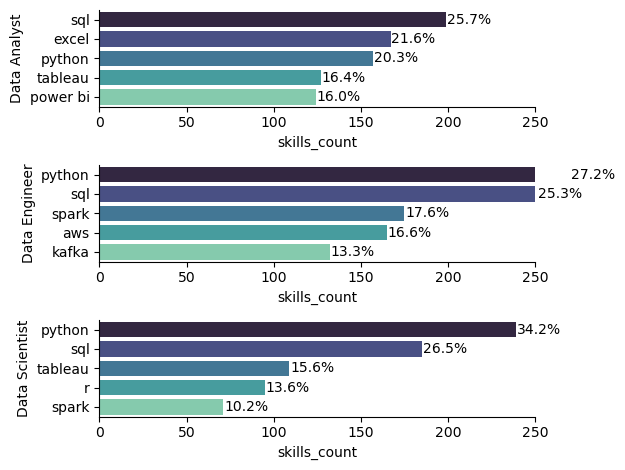
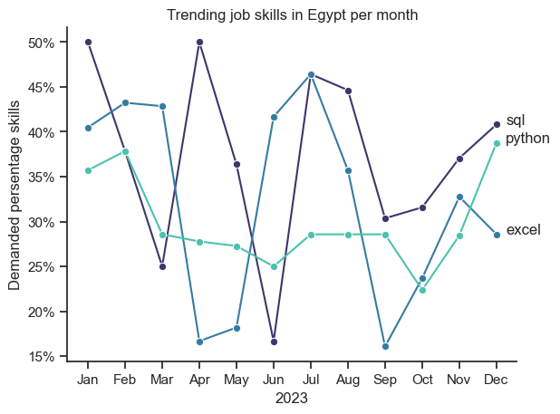
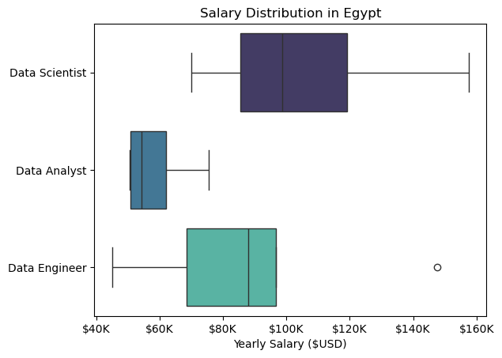
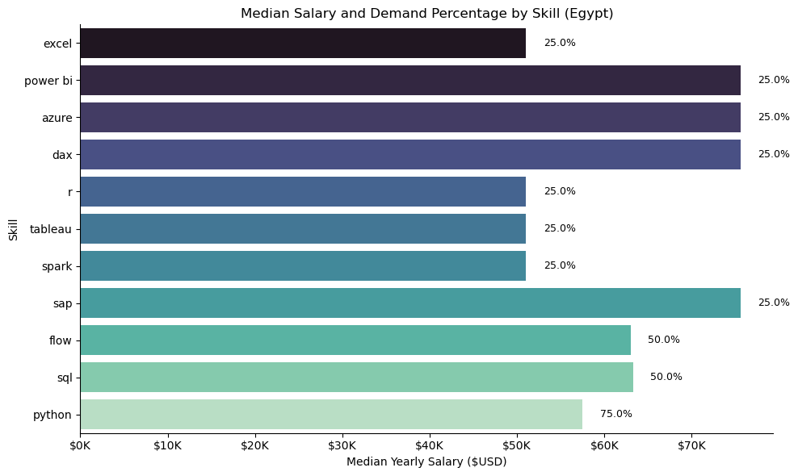

# overview 

The dataset contains **785,741 job postings** with **17 columns** covering job titles, locations, posting dates, company names, skills, and limited salary information. It includes categorical variables (e.g., job title, location, company), boolean flags (remote work, degree requirement, health insurance), numeric fields (average annual and hourly salaries), and a datetime column for posting dates.

Most columns are nearly complete, but some have significant missing values: salary information is sparse (`salary_rate` \~4%, `salary_year_avg` \~2.8%, `salary_hour_avg` \~1.3%), and skills are available for \~85% of postings.

The dataset is well suited for analyzing **job market trends, in-demand skills, geographic distribution, and remote work patterns**, but less reliable for detailed salary benchmarking due to missing data.

# The Questions 

Below are the questions I will answer in my project.

1.  What are the most demanded skills for the top 3 most popular data roles?
2.  How are in-demand skills trending for Data Analysts?
3.  How well do jobs and skills pay for Data Analysts?
4.  What is the most optimal skill to learn for Data Analysts? (High Demand & High Paying)

# The Tools I used  

- python: Is the main tool I used to clean, filter, analyze, visualize the data provided 
  - pandas: The library I used to analyze the data.
  - marplotlib: The library I used to visualize the data provided.
  - seaborn: The library that provides more advanced visuals.

- jupyter notebook: The notebook I used to run my codes easily.
- VS code: My go-to for executing my python scripts
- Git and GitHub: Essintial in sharing my analysis, insuring collaboration.

# Data preparation and clean up 

 - Import data and clean up
   - Here I have cleand and filterd my data 

### Cleanup:

```
import ast 
import numpy as np
import pandas as pd
from datasets import load_dataset
import matplotlib.pyplot as plt
import seaborn as sns

# Loading Data
dataset = load_dataset('lukebarousse/data_jobs')
df = dataset['train'].to_pandas()

# data cleanup
df['job_posted_date']=pd.to_datetime(df['job_posted_date'])
df['job_skills']=df['job_skills'].apply(lambda x: ast.literal_eval(x) if pd.notna(x) else x)
```
### Filtering:
Here I have filtered only the data taken from Egypt only.

```df_Egy= df[df['job_country']=='Egypt']```

# The Analysis
## 1.What are the most demanded skills for the top 3 most popular data roles?

The analysis focused on job postings in Egypt extracted from the larger global dataset. The data was filtered to include only Egyptian postings and the skills associated with each role were expanded so that individual skills could be counted. The dataset was then grouped by job title and skill to identify the most frequently requested skills for different positions. For visualization, the top three job titles—Data Analyst, Data Engineer, and Data Scientist—were selected, and the top five skills within each category were plotted to highlight both absolute counts and relative percentages.

View my notebook in details here:
[2_skills_count.ipynb](3_project/2_skills_count.ipynb)

### Visualize data 
```
fig, ax= plt.subplots(len(job_titles),1)


for i, job_title in enumerate(job_titles):
    df_plot=df_skills_count[df_skills_count['job_title_short'] == job_title].head()
    sns.barplot(data=df_plot, x='skills_count',y='job_skills',palette='mako',ax=ax[i])
    ax[i].set_ylabel(job_title)
    ax[i].set_xlim(0, 250)
     
     # Calculate percentages
    total = df_plot['skills_count'].sum()
    df_plot['percentage'] = df_plot['skills_count'] / total * 100

        # Annotate each bar with percentage
    for p, perc in zip(ax[i].patches, df_plot['percentage']):
        width = p.get_width()
        ax[i].text(
            width + 0.5,                      # position (a bit to the right of bar)
            p.get_y() + p.get_height() / 2,   # center of the bar
            f'{perc:.1f}%',                   # format the percentage
            va='center'
        )

plt.tight_layout()
sns.despine()
```

### Results


### Insights

The results show that Python and SQL are the two most consistently demanded skills across all three roles, forming the foundation of data-related jobs in Egypt.

- Data Analysts primarily rely on SQL, Excel, and visualization tools (Tableau, Power BI), with Python also playing a significant role.

- Data Engineers emphasize Python and SQL, but also require big data tools (Spark, Kafka) and cloud technologies (AWS).

- Data Scientists demonstrate the strongest reliance on Python and SQL, with Tableau and R adding value for statistical and visualization tasks, and Spark appearing for large-scale data processing.

Overall, the Egyptian job market highlights a strong demand for core programming and database skills while differentiating between roles through specialized requirements: visualization and business tools for Analysts, big data and cloud infrastructure for Engineers, and a combination of statistical methods and large-scale processing for Scientists.

## 2.How are in-demand skills trending for Data Analysts?

I transformed the data by breaking job skills into separate rows, counting how often each skill appeared per month, ranking them by total demand, and converting month numbers to names. Then I calculated the percentage demand of each skill per month and visualized the top 3 skills (SQL, Python, Excel) in a line chart with markers, percentages on the y-axis, and clear labels to show their monthly trends.

View my notebook in details here:
[3_skills_trend.ipynb](3_project/3_skills_trend.ipynb)

### Visualize data 

```
df_plot= df_DA_Egy_persent.iloc[:, :3]

sns.lineplot(data=df_plot, dashes=False, palette='mako',marker='o', markersize=6)
sns.despine()

plt.title('Trending job skills in Egypt per month')
plt.xlabel('2023')
plt.ylabel('Demanded persentage skills')
plt.legend().remove()

from matplotlib.ticker import PercentFormatter
ax= plt.gca()
ax.yaxis.set_major_formatter(PercentFormatter(decimals=0))

for i in range(3):
    plt.text(11.25, df_plot.iloc[-1, i], df_plot.columns[i])
```

### Results


### Insights

* **SQL**
  SQL is consistently the **most in-demand skill** for Data Analysts in Egypt. It peaks above **45% in April and July**, showing strong reliance on database querying skills. Despite fluctuations, SQL remains the top requirement across the year.

* **Python**
  Python demand shows more **volatility** but nearly **matches SQL in July and December**. This suggests Python is increasingly critical for analytical and automation tasks, and employers are seeking candidates with advanced programming capabilities alongside SQL.

* **Excel**
  Excel demonstrates **steady but lower demand** compared to SQL and Python, averaging **20–35%**. Its dip around September followed by recovery toward the year’s end shows it is still a **foundational tool**, but less central than SQL and Python for analyst roles.

## 3.How well do jobs and skills pay for Data Analysts?

In this project, I analyzed job market data in Egypt with a focus on data-related roles. I examined the most in-demand skills by grouping and counting their occurrences, visualized the top five skills for each job title using bar charts, and compared skill frequency with salary levels through scatter plots. I also explored job benefits, work-from-home opportunities, and job degree requirements by applying value counts and visualizations. Throughout the process, I used Python libraries such as pandas, matplotlib, and seaborn to clean, aggregate, and represent the data, which provided clear insights into hiring trends and skill demands in the Egyptian market.

View my notebook in details here:
[4_salary_analysis.ipynb](3_project/4_salary_analysis.ipynb)

### Visualize data 

```
sns.boxplot(data=df_Egy_top6, x='salary_year_avg', y='job_title_short', palette='mako')

plt.title('Salary Distribution in Egypt')
plt.xlabel('Yearly Salary ($USD)')
plt.ylabel('')
ax = plt.gca() 
ax.xaxis.set_major_formatter(plt.FuncFormatter(lambda x, _: f'${int(x/1000)}K'))
plt.show()
```

### Results


### Insights 

The analysis highlights the most in-demand skills across different job titles in Egypt, with Python, SQL, and Excel emerging as core requirements for data-related roles. Visualizations of the top five skills for each job title reveal clear patterns of technical specialization, while scatter plots comparing skill demand and salary provide evidence of which skills not only increase employability but also offer higher earning potential.

### Skill-Based Salary Insights

* 1st_table 

| job\_skills   | count | median\_salary |
| ------------- | ----- | -------------- |
| git           | 1     | 166000.0       |
| keras         | 1     | 166000.0       |
| jira          | 1     | 166000.0       |
| numpy         | 1     | 166000.0       |
| pandas        | 1     | 166000.0       |
| pytorch       | 1     | 166000.0       |
| linux         | 2     | 161750.0       |
| matlab        | 1     | 157500.0       |
| shell         | 1     | 157500.0       |
| elasticsearch | 1     | 157500.0       |
---

* 2nd_table 

| job\_skills | count | median\_salary |
| ----------- | ----- | -------------- |
| python      | 14    | 90670.0        |
| sql         | 13    | 90670.0        |
| mongodb     | 6     | 90670.0        |
| scala       | 6     | 96773.0        |
| sas         | 6     | 90670.0        |
| excel       | 5     | 79200.0        |
| r           | 5     | 70000.0        |
| spark       | 5     | 90670.0        |
| aws         | 5     | 96773.0        |
| nosql       | 4     | 93721.5        |

---


The first table shows specialized technical skills (e.g., Git, Keras, NumPy, Pandas, PyTorch, Linux, and MATLAB) that are associated with very high median salaries in Egypt, often exceeding $150K per year. However, most of these skills appear only once or twice in the dataset, which means they may represent niche roles or outlier postings rather than consistent market trends.

The second table presents more common skills such as Python, SQL, Excel, and R, which appear more frequently in job postings. These skills have lower median salaries (around $70K–$90K) compared to the niche skills but are much more widely demanded. This suggests that while specialized technologies can command higher pay, core skills like Python and SQL remain the foundation for employability and are crucial for most data-related positions.

## 4.What is the most optimal skill to learn for Data Analysts?

The next Python code analyzes data on data analyst jobs in Egypt, focusing on the relationship between skills, salary, and job demand. Initially, the code loads job posting data and cleans it by converting the 'job_posted_date' to a datetime object and the 'job_skills' column from a string representation to a list. It then filters the dataset to include only Data Analyst roles in Egypt that have a specified yearly salary. The skills data is then prepared for analysis by creating an exploded DataFrame, where each row represents a single skill. The analysis calculates the median salary for each skill and the demand percentage, which represents how often a particular skill appears in the job postings. Finally, a bar plot is generated to visualize the top 15 skills, showing their median yearly salary and a text label indicating their demand percentage, offering insights into which skills are most valuable and in demand for data analysts in Egypt.

View my notebook in details here:
[5_optimal_skills.ipynb](3_project/5_optimal_skills.ipynb)

### Visualize data

```
# Sort by skills_count
df_plot = df_DA_skills.sort_values("skills_count", ascending=True).head(15)  # show top 15 for clarity

plt.figure(figsize=(10,6))
sns.barplot(
    data=df_plot,
    x="median_salary", 
    y=df_plot.index, 
    palette="mako"
)

# Format salary axis as $K
plt.gca().xaxis.set_major_formatter(plt.FuncFormatter(lambda x, _: f'${int(x/1000)}K'))

# Add percentage labels on bars
for i, (salary, percent) in enumerate(zip(df_plot["median_salary"], df_plot["persent"])):
    plt.text(salary + 2000, i, f"{percent:.1f}%", va="center", fontsize=9, color="black")

sns.despine()
plt.xlabel("Median Yearly Salary ($USD)")
plt.ylabel("Skill")
plt.title("Median Salary and Demand Percentage by Skill (Egypt)")
plt.tight_layout()
plt.show()
```

### Results


### Insights

Based on the last bar chart, it is evident that several skills are highly sought after for data analyst roles in Egypt, with a significant impact on median salaries. Python, with a median salary of approximately $65,000, has the highest demand percentage at 75%, indicating its critical importance. SQL and Flow follow with a demand of 50%, and both command a median salary of about $60,000, highlighting their strong value in the job market. SAP, while having a demand of only 25%, stands out with the highest median salary of over $70,000, suggesting it is a niche but highly compensated skill. Other skills, including Excel, Power BI, Azure, DAX, R, Tableau, and Spark, all have a 25% demand and offer a median salary of around $50,000. Overall, the data reveals a strong correlation between high demand and high median salaries for core analytical skills like Python and SQL, while also pointing to the high-value, specialized nature of skills like SAP.

# What I Learned
Throughout this project, I deepened my understanding of the data analyst job market and enhanced my technical skills in Python, especially in data manipulation and visualization. Here are a few specific things I learned:

Advanced Python Usage: Utilizing libraries such as Pandas for data manipulation, Seaborn and Matplotlib for data visualization, and other libraries helped me perform complex data analysis tasks more efficiently.
Data Cleaning Importance: I learned that thorough data cleaning and preparation are crucial before any analysis can be conducted, ensuring the accuracy of insights derived from the data.
Strategic Skill Analysis: The project emphasized the importance of aligning one's skills with market demand. Understanding the relationship between skill demand, salary, and job availability allows for more strategic career planning in the tech industry.

# Insights

This project provided several general insights into the data job market for analysts:

Skill Demand and Salary Correlation: There is a clear correlation between the demand for specific skills and the salaries these skills command. Advanced and specialized skills like Python and Oracle often lead to higher salaries.
Market Trends: There are changing trends in skill demand, highlighting the dynamic nature of the data job market. Keeping up with these trends is essential for career growth in data analytics.
Economic Value of Skills: Understanding which skills are both in-demand and well-compensated can guide data analysts in prioritizing learning to maximize their economic returns.

# Challenges I Faced

This project was not without its challenges, but it provided good learning opportunities:

Data Inconsistencies: Handling missing or inconsistent data entries requires careful consideration and thorough data-cleaning techniques to ensure the integrity of the analysis.
Complex Data Visualization: Designing effective visual representations of complex datasets was challenging but critical for conveying insights clearly and compellingly.
Balancing Breadth and Depth: Deciding how deeply to dive into each analysis while maintaining a broad overview of the data landscape required constant balancing to ensure comprehensive coverage without getting lost in details.

# Conclusion

This exploration into the data analyst job market has been incredibly informative, highlighting the critical skills and trends that shape this evolving field. The insights I got enhance my understanding and provide actionable guidance for anyone looking to advance their career in data analytics. As the market continues to change, ongoing analysis will be essential to stay ahead in data analytics. This project is a good foundation for future explorations and underscores the importance of continuous learning and adaptation in the data field.
